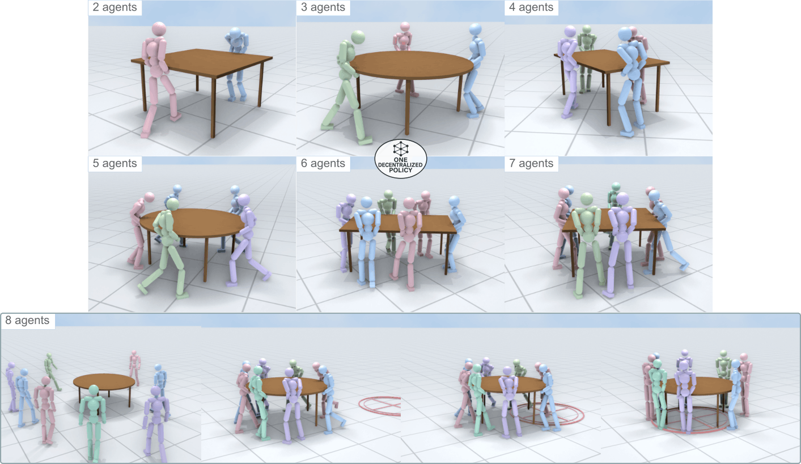
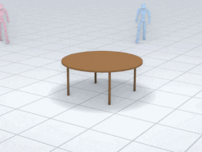

<br>
<p align="center">
<h2 align="center">
<strong>👥 TeamHOI: Learning a Unified Policy for Cooperative <br> Human-Object Interactions with Any Team Size</strong>
</h2>

<p align="center">
  <a href='https://splionar.github.io/' target='_blank'><strong>Stefan Lionar</strong></a>&emsp;
  <a href='https://www.comp.nus.edu.sg/~leegh/' target='_blank'><strong>Gim Hee Lee</strong></a>
</p>

<p align="center">
  <a href='https://www.garena.sg/' target='_blank'>Garena</a>&emsp;
  <a href='https://sail.sea.com/' target='_blank'>Sea AI Lab</a>&emsp;
  <a href='https://www.comp.nus.edu.sg/' target='_blank'>National University of Singapore</a>
</p>

<h2 align="center">CVPR 2026</h2>
</p>


<div align="center">
<a href="https://splionar.github.io/TeamHOI/"> </a>&nbsp;&nbsp;
<a href="https://splionar.github.io/TeamHOI/"></a>&nbsp;&nbsp;
 <a href="https://splionar.github.io/TeamHOI/TeamHOI.pdf"></a> 
</div>


## ✨ Overview

<div align="justify">
    TeamHOI is a novel framework for learning a unified decentralized policy for cooperative human-object interactions (HOI) that works seamlessly across varying team sizes and object configurations.<br> <br>
    We evaluate our framework on a cooperative table transport task, where multiple agents must coordinate to form stable lifting formation and subsequently carry the object.
</div>

<br>


<div style="text-align:center;">
  
</div>

<br>


<table align="center"
       style="border-collapse: collapse; border: none;">
  <tr style="border: none;">
    <td align="center" style="border: none; padding: 0 12px;">
      <b>2 Agents</b>
    </td>
    <td align="center" style="border: none; padding: 0 12px;">
      <b>4 Agents</b>
    </td>
    <td align="center" style="border: none; padding: 0 12px;">
      <b>8 Agents</b>
    </td>
  </tr>
  <tr style="border: none;">
    <td align="center" style="border: none; padding: 8px 12px;">
      
    </td>
    <td align="center" style="border: none; padding: 8px 12px;">
      
    </td>
    <td align="center" style="border: none; padding: 8px 12px;">
      
    </td>
  </tr>
</table>


## 🚀 Getting Started

To set up **TeamHOI**, follow the steps below:

### 1. Clone the repository and create conda environment

```
git clone https://github.com/sail-sg/TeamHOI.git
cd TeamHOI

conda create -n teamhoi python=3.8.20
conda activate teamhoi
```
### 2. Download and install IsaacGym

```
wget https://developer.nvidia.com/isaac-gym-preview-4
tar -xvzf isaac-gym-preview-4
pip install -e isaacgym/python
```

If encounter an error `ImportError: libpython3.8m.so.1.0: cannot open shared object file: No such file or directory`, do the following:

```
export LD_LIBRARY_PATH="/path/to/conda/envs/teamhoi/lib:$LD_LIBRARY_PATH"
```

### 3. Install other dependencies

```
pip install -r requirements.txt
```

## 🤖 Inference

<div align="center">
  
</div>
<br>
A sample of inference command is as follows:

```
python teamhoi/run.py --system_max_humanoids 8 --num_envs 3 --fix_num_humanoids 8 \
--checkpoint checkpoints/8agents.pth \
--assets default_round,default_square,default_rectangle \
--episode_length 600 --test
```

<h4 align="left">Key arguments:</h4>
<ul>
  <li><code>--system_max_humanoids</code>: maximum team size used during training. It should match the configuration used during training.</li>
  <li><code>--fix_num_humanoids</code>: number of agents used at inference simulation. If not specified, it will be sampled from 2 to <code>--system_max_humanoids</code>.</li>
  <li><code>--num_envs</code>: number of parallel simulation environments.</li>
  <li><code>--checkpoint</code>: path to pretrained policy.</li>
  <li><code>--assets</code>: object names (comma-separated) specified in <code>assets</code> folder.</li>
  <li><code>--episode_length</code>: episode horizon (simulation steps).</li>
</ul>

## 🦾 Training

### 1. Stage 1: Walk + lift (4 agents)

```
python teamhoi/run.py --system_max_humanoids 4 --num_envs 1024 --min_humanoids 1 \
--cfg_train cfg/teamhoi_stage1.yaml --motion_file2 cfg_motions/near_table_stage1.yaml \
--exp_name MyExperiment --wandb_name "MyExperiment_4Ag_stage1" \
--assets default_round,default_square,default_rectangle \
--goal_multiplier 0 --episode_length 400 --headless
```


### 2. Stage 1 + 2: Walk + lift + transport (4 agents)

```
python teamhoi/run.py --system_max_humanoids 4 --num_envs 1024 --min_humanoids 2 \
--cfg_train cfg/teamhoi.yaml --motion_file2 cfg_motions/near_table.yaml \
--exp_name MyExperiment --wandb_name "MyExperiment_4Ag" \
--assets default_round,default_square,default_rectangle \
--goal_multiplier 1 --episode_length 600 --headless
```

### 3. Stage 1 + 2: Walk + lift + transport (8 agents finetune)

```
python teamhoi/run.py --system_max_humanoids 8 --num_envs 1024 --min_humanoids 2 \
--cfg_train cfg/teamhoi.yaml --motion_file2 cfg_motions/near_table.yaml \
--exp_name MyExperiment --wandb_name "MyExperiment_8Ag" \
--assets default_round,default_square,default_rectangle \
--goal_multiplier 1 --episode_length 600 --headless
```


<h4 align="left">Additional key arguments:</h4>
<ul>
  <li><code>--min_humanoids</code>: Minimum team size when sampling team sizes (range: <code>--min_humanoids</code> to <code>--system_max_humanoids</code>).</li>
  <li><code>--motion_file2</code>: Reference motions used when agents are near objects.</li>
  <li><code>--exp_name</code>: Experiment name. Checkpoints will be saved to <code>output/[experiment name]</code>.</li>
  <li><code>--goal_multiplier</code>: A multiplier for transport goal state. Set to 0 to disable transport goal state during stage 1 training.</li>
</ul>

Training always continues from `output/[experiment name]/ckpt.pth`.

## 🙏 Acknowledgment
This work builds upon ideas and open-source implementations from the following projects: 
- [CooHOI](https://github.com/Winston-Gu/CooHOI)  
- [TokenHSI](https://liangpan99.github.io/TokenHSI/)  
- [SMPLOlympics](https://github.com/SMPLOlympics/SMPLOlympics)  

We sincerely thank the authors for making their research and code publicly available.